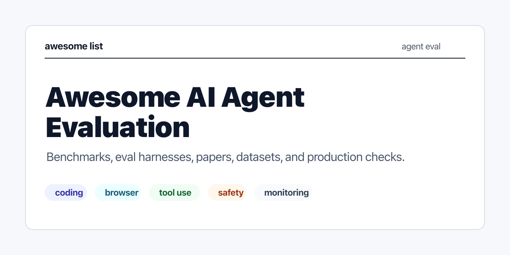

# Awesome AI Agent Evaluation

  
  <a href="README.md">English</a>

AI Agent 评测资源地图：benchmark、框架、论文、数据集、回归测试和生产监控。

只收能帮助测试、比较、调试或监控 Agent 行为的资源。

<table>
  <tr>
    <th>会收</th>
    <th>不收</th>
  </tr>
  <tr>
    <td>任务清楚的 benchmark</td>
    <td>泛泛的 Agent demo</td>
  </tr>
  <tr>
    <td>能跑 eval 的框架</td>
    <td>没有评测方法的 prompt 集合</td>
  </tr>
  <tr>
    <td>方法能复用的论文</td>
    <td>没有技术细节的营销页</td>
  </tr>
</table>

## 从哪里看

<table>
  <tr>
    <th>如果你关心...</th>
    <th>建议先看</th>
  </tr>
  <tr>
    <td>软件工程任务</td>
    <td><a href="README.md#coding-agent-evaluation">Coding Agent Evaluation</a></td>
  </tr>
  <tr>
    <td>网站和 UI 操作</td>
    <td><a href="README.md#browser--web-agent-evaluation">Browser / Web Agent Evaluation</a></td>
  </tr>
  <tr>
    <td>API 和函数调用</td>
    <td><a href="README.md#tool-use-and-function-calling">Tool-Use and Function Calling</a></td>
  </tr>
  <tr>
    <td>回归测试和失败恢复</td>
    <td><a href="README.md#reliability--failure-recovery">Reliability & Failure Recovery</a></td>
  </tr>
  <tr>
    <td>Prompt injection 和有害行为</td>
    <td><a href="README.md#safety--robustness">Safety & Robustness</a></td>
  </tr>
  <tr>
    <td>日志、trace、成本和质量漂移</td>
    <td><a href="README.md#production-monitoring">Production Monitoring</a></td>
  </tr>
</table>

## 分类说明

展开分类

- [Evaluation Basics](README.md#evaluation-basics) / 评测基础：任务设计、评分方式、trace 和产品 eval。
- [Benchmarks](README.md#benchmarks) / 基准测试：真实任务、交互环境和工具调用任务集。
- [Evaluation Frameworks](README.md#evaluation-frameworks) / 评测框架：把 eval 跑起来、记录下来、放进 CI。
- [Coding Agent Evaluation](README.md#coding-agent-evaluation) / 编程 Agent：仓库理解、issue 修复、测试通过和补丁质量。
- [Browser / Web Agent Evaluation](README.md#browser--web-agent-evaluation) / 浏览器 Agent：网页导航、视觉理解、表单操作和状态变更。
- [Tool-Use and Function Calling](README.md#tool-use-and-function-calling) / 工具调用：API 选择、参数构造、多轮调用和执行结果。
- [Multi-Agent Evaluation](README.md#multi-agent-evaluation) / 多 Agent：协作、角色分工、通信成本和最终产出。
- [Safety & Robustness](README.md#safety--robustness) / 安全与鲁棒性：prompt injection、越权工具调用、有害请求和数据泄露。
- [Reliability & Failure Recovery](README.md#reliability--failure-recovery) / 可靠性：重试、修正、状态恢复和回归风险。
- [Cost, Latency, and Efficiency](README.md#cost-latency-and-efficiency) / 成本与延迟：token、模型调用、工具调用、耗时和预算。
- [Human Evaluation Rubrics](README.md#human-evaluation-rubrics) / 人工评审：给 trace、对话、工具调用和最终结果打分。
- [Production Monitoring](README.md#production-monitoring) / 生产监控：trace、质量分、成本、延迟、失败率和漂移。
- [Papers](README.md#papers) / 论文：主要 benchmark 和方法论来源。
- [Datasets](README.md#datasets) / 数据集：训练、评测或复现实验用的 Agent 任务数据。
- [Reports & Case Studies](README.md#reports--case-studies) / 报告与案例：榜单结果、系统表现和评测实践。
- [Related Awesome Lists](README.md#related-awesome-lists) / 相关列表：LLM eval、Agent 框架和生产机器学习等邻近领域。

轻量文档站中文入口见 [docs/zh-CN/index.md](docs/zh-CN/index.md)。完整资源清单见英文 [README.md](README.md)。

## 贡献

欢迎提交 PR 或 issue。收录规则见 [CONTRIBUTING.zh-CN.md](CONTRIBUTING.zh-CN.md)。

优先推荐这些资源：

- 和 AI Agent 评测直接相关
- 官方链接稳定
- 能帮读者做判断
- 有明确 benchmark、数据集、工具、论文或生产实践价值

不建议提交这些资源：

- 泛 LLM 工具，但没有 Agent 评测重点
- 低质量博客或 SEO 页面
- 纯营销页
- 重复资源
- 只有 prompt，没有评测方法

## License

本项目使用 [CC0-1.0](LICENSE) 发布。
